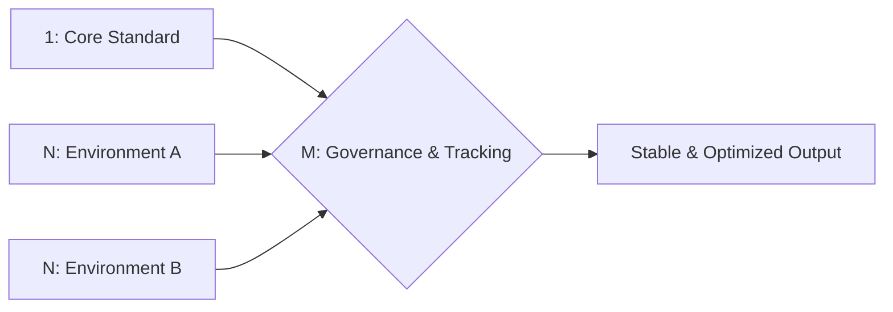

# 🌐 1+N+M Framework: Structured Execution & Governance for IT Operations

> **Focus · Adapt · Govern**  
> A lightweight, repeatable framework for IT support, system administration, and automation governance.  
> Designed to bridge hands-on troubleshooting with strategic oversight.

## 📊 Visual Representation



## GitHub Repo Structure
```bash
1NM-IT-Governance-Framework/
├── README.md                 # 主文件（下方提供完整模板）
├── docs/
│   ├── methodology.md        # 詳細拆解：1、N、M 定義與應用場景
│   ├── itil-alignment.md     # 如何對應 ITIL/SLA/審計要求
│   └── ai-automation-control.md # 你提到嘅 AI 控制邏輯（輸入/輸出/版本/驗證）
├── templates/
│   ├── incident-response-checklist.md
│   ├── deployment-tracking-sheet.md
│   └── macro-dashboard-template.md
├── examples/
│   ├── it-support-workflow/  # IT Support 實際應用
│   └── ai-pilot-governance/  # AI/自動化落地控制
└── LICENSE
```

## 🧭 Core Philosophy

| Layer | Meaning | IT Application |
|:-----:|---------|----------------|
| **`1`** | **Core Standard / Single Source of Truth** | Fixed SOP, security baseline, or service objective. Never compromised. |
| **`N`** | **N Contexts / Execution Variables** | Different users, systems, departments, or deployment environments. |
| **`M`** | **M Governance Layers / Macro View** | SLA tracking, audit trails, version control, continuous optimization. |

### 🔹 Why This Works
- **Prevents ad-hoc fixes**: Every action ties back to a documented standard (`1`)
- **Scales across environments**: Adapts to `N` variables without losing consistency
- **Enables continuous improvement**: `M` layer tracks metrics, versions, and feedback loops
- **AI & Automation Ready**: Built-in input validation, output formatting, and version control


## 🛠️ How It Applies to IT Support & Administration

### ✅ Incident Management
1 = Standard Triage Protocol (Severity, SLA, Escalation Path)
N = N User Contexts (Remote, On-site, VIP, Non-technical)
M = M Tracking Layers (Ticket ID, Root Cause, KB Update, Post-Mortem)

### ✅ System Deployment & Automation
1 = Core Architecture Principle (Zero Trust, Least Privilege, Backup-First)
N = N Target Environments (Dev/Test/Prod, Hybrid Cloud, Legacy/Modern)
M = M Control Gates (Versioning, Peer Review, Rollback Plan, Audit Log)


### ✅ AI & Automation Governance
*(Inspired by AWS engineering practices)*
- **Input Control**: Only verified, official data sources
- **Output Control**: Fixed schema, no hallucination, structured logging
- **Versioning**: Prompt/Workflow = Code. Track changes, test in sandbox, document
- **1+N+M in Practice**: `1` Core Rule → `N` Industry Contexts → `M` Validation Gates

## 📂 How to Use This Framework

| Step | Action | Output |
|------|--------|--------|
| 1️⃣ Define `1` | Set the non-negotiable baseline (SOP/Security/SLA) | `docs/core-standard.md` |
| 2️⃣ Map `N` | Identify variables per user/system/deployment | `templates/context-matrix.md` |
| 3️⃣ Layer `M` | Add tracking, versioning, and review checkpoints | `templates/governance-log.md` |
| 🔄 Iterate | Update based on metrics, audit, or user feedback | Continuous KB improvement |

## 🔗 Alignment with Industry Standards
- ✅ **ITIL v4**: Incident → Problem → Change → Knowledge
- ✅ **DevOps**: CI/CD mindset applied to IT workflows & documentation
- ✅ **Zero Trust / Security**: Verify explicitly, least privilege, assume breach
- ✅ **AI Governance**: Input validation, output schema, version control, human-in-the-loop

## 📈 Real-World Impact (Case Examples)
| Scenario | Before 1+N+M | After 1+N+M |
|----------|--------------|-------------|
| User can't access M365 | Ad-hoc fixes, repeat tickets | Standard triage → KB update → 60% ticket reduction |
| Deploy Telegram Bot automation | Manual testing, no rollback | Version-controlled prompt → sandbox test → audit log |
| C-level requests vs IT capacity | Reactive, scope creep | Clarify `1` (business goal) → map `N` (constraints) → propose `M` (phased delivery) |

## 📥 Get Started
1. Clone or fork this repo
2. Use `templates/` for your own IT workflows
3. Adapt `examples/` to your environment
4. Contribute: PRs welcome for new use cases or governance checklists

> 📌 *"AI is smart, but professionalism comes from structured knowledge + controlled execution."*

---
👤 Maintained by [Michael Ho](https://github.com/michaelho278-bot)  
🔗 Full Portfolio: [Michael-Professional-Portfolio](https://github.com/michaelho278-bot/Michael-Professional-Portfolio)  
📄 License: MIT